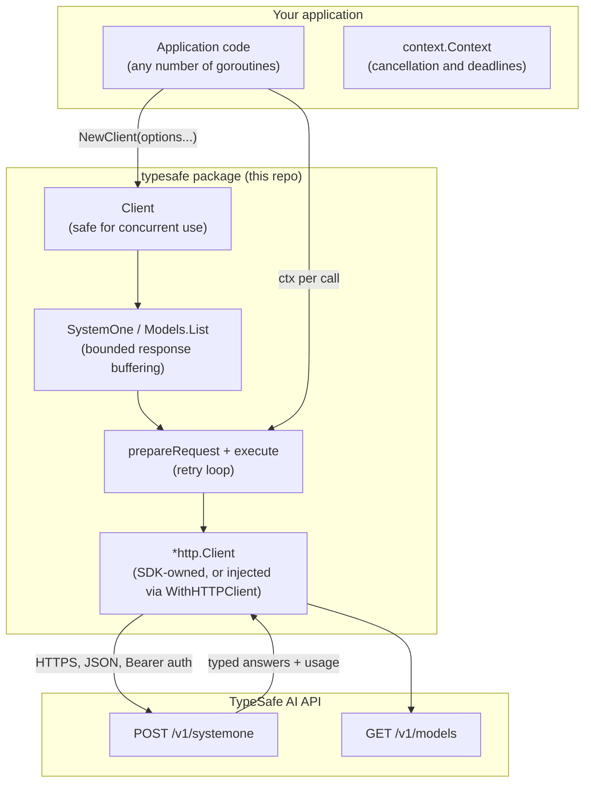
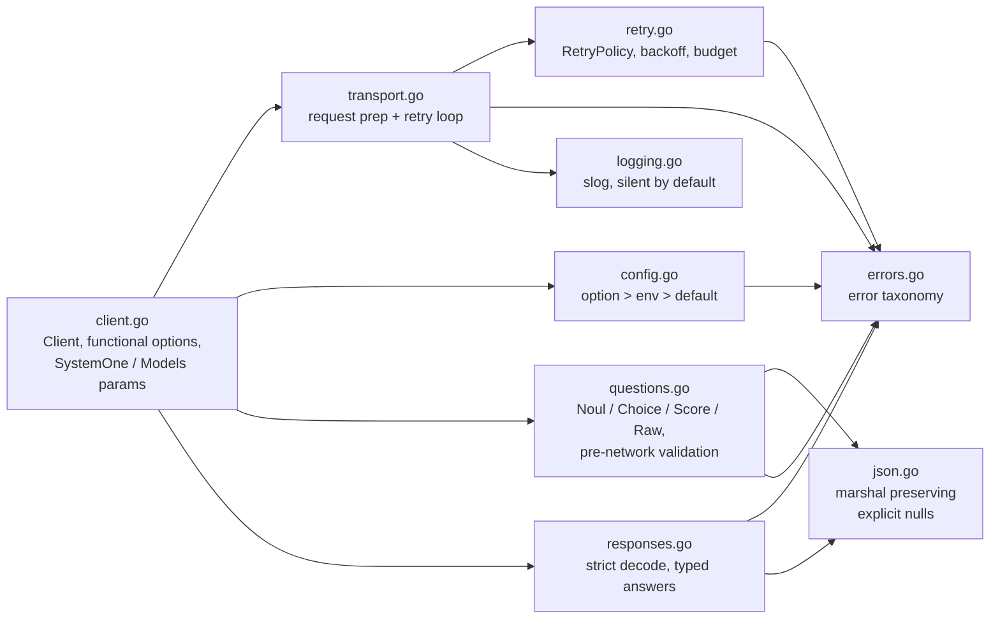
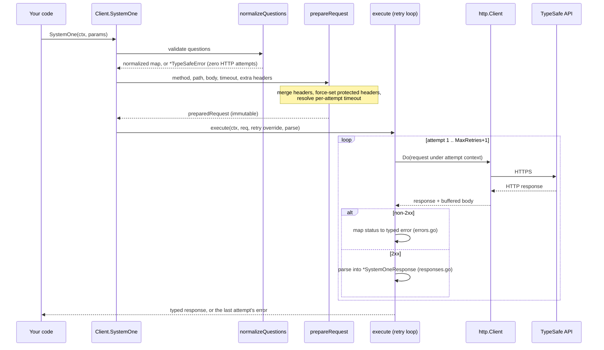
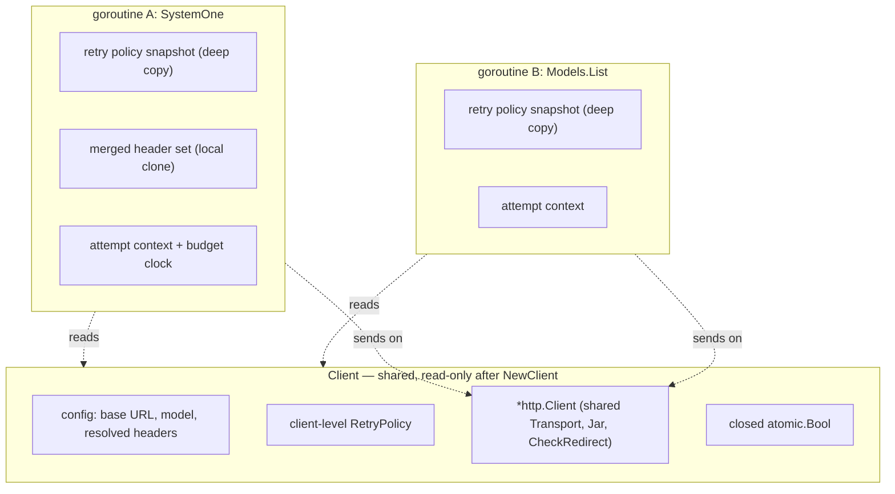
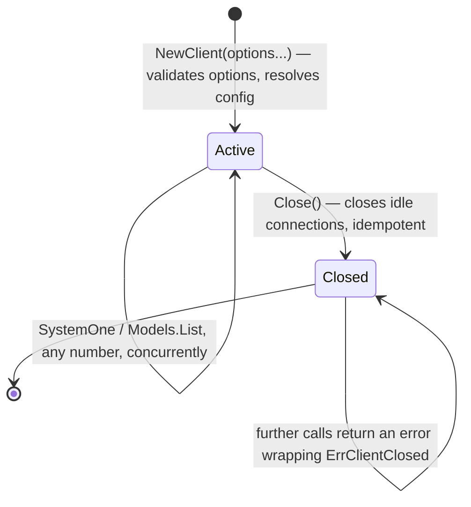

# Architecture

The SDK is a single flat Go package (`package typesafe`) at the repo root —
no `pkg/`, no `internal/`, no subpackages. One file per concern. It has **zero
runtime dependencies**: the Go standard library only.

## System context

Design intent: your code holds one `Client` for the process lifetime; all
per-call variation (model, timeout, retry policy, extra headers) is passed per
call and never leaks between calls.

## Module map

## Life of a call

Two properties worth knowing:

- **Encode once.** The request body is marshaled a single time per call and
  reused verbatim on retries — including raw criteria with custom JSON/text
  marshalers, which must not be invoked repeatedly.
- **Fail before dialing.** Question validation, option validation, and body
  encoding all happen before any network I/O.

## Concurrency model

The client is safe for concurrent use. Everything mutable about a call lives
in that call's stack; the shared `Client` is read-only after construction
(verified under `-race` in CI).

## Client lifecycle

`Close` closes idle connections of the underlying `*http.Client` — the
SDK-owned one *and* one you supplied via `WithHTTPClient`. Using a closed
client is a typed error (`ErrClientClosed`), not a transport panic. Go has no
full-close API, so `Close` means *idle* connections only
([README deviation 10](../README.md#deviations-from-the-python-sdk)).

## Decision ledger

Decisions that shape everything above, with their rationale:

- **Zero runtime dependencies** — mirrors the TypeScript SDK's zero-dep
  philosophy; the HTTP, JSON, and logging machinery is all stdlib
  (`net/http`, `encoding/json`, `log/slog`).
- **Flat single package** — the surface is small and stable; subpackages would
  add import-path ceremony without a real boundary.
- **Hand-written wire structs, no codegen** — the question/answer set is
  small and stable; codegen would add a build step and a dependency for
  nothing.
- **Python v0.7.0 is the parity baseline** — where Python and JS references
  disagree, Python wins; deliberate Go deviations are ledgered in
  [README §Deviations](../README.md#deviations-from-the-python-sdk)
- **Validate before network I/O** — the same client-side guarantee Python
  gets from eager construction, adapted to Go constructors, which cannot
  return errors
- **Silent-by-default `log/slog`** — libraries must not log unless asked;
  see [Observability](observability.md).
- **Security defaults** — wire bodies are redacted by default, response
  buffering is bounded, HTTPS base URLs are required, and SDK-owned body
  fields cannot be overridden by `ExtraBody`; loopback HTTP is an explicit
  opt-in.

## Where to read next

- How options, env vars, and timeouts resolve: [Configuration](configuration.md)
- What the retry loop does exactly: [Retries and timeouts](retries.md)
- What bytes go on the wire: [Wire protocol](wire-protocol.md)
