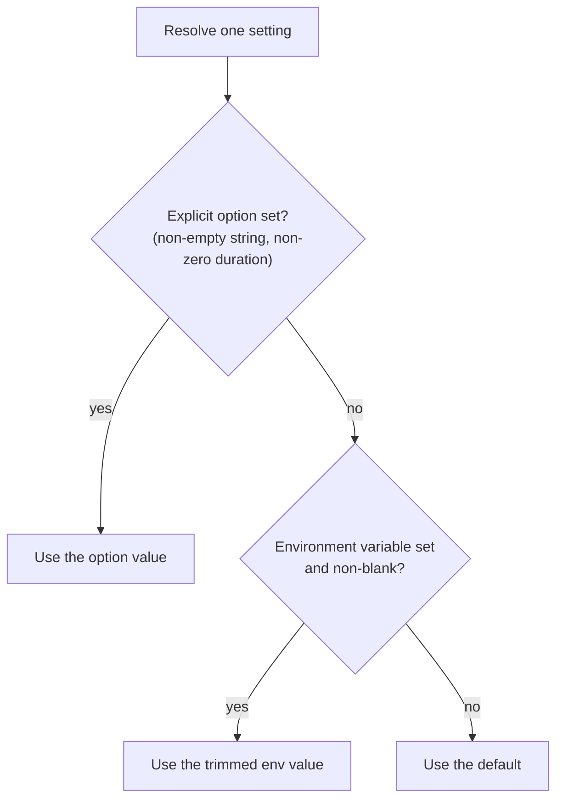
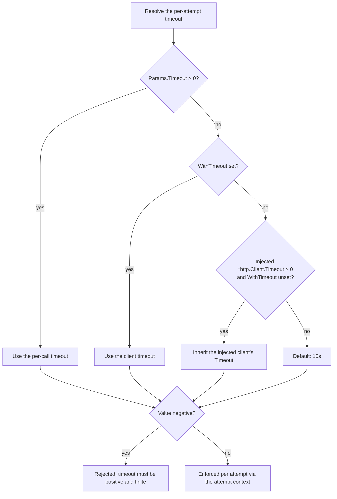

# Configuration

A client is built once with `typesafe.NewClient(opts...)` and shared. Settings
resolve in a strict order, and the non-obvious part is what counts as "unset".

Owners: `config.go` (`resolveConfig`), `client.go` (functional options),
verified by `config_test.go` and `client_test.go`. The full options and
environment-variable tables live in
[README §Configuration](../README.md#configuration); this page explains the
resolution rules themselves.

## Precedence: explicit option > environment > default

Blank-value semantics, which trip people up:

- Blank environment values are ignored, as if unset.
- Empty explicit strings (and whitespace-only explicit API keys) **inherit** —
  they fall through to the environment and then the default.
- Every other explicit string — base URLs, model names, non-blank API keys —
  is preserved verbatim.
- Zero-value sentinels: a zero `time.Duration` timeout means "unset"
  (inherit), and an empty `Model` means "use the default"
  ([README deviation 9](../README.md#deviations-from-the-python-sdk)).

Settings: API key (`TYPESAFE_API_KEY`), base URL (`TYPESAFE_BASE_URL`,
trailing slashes stripped), default model (`TYPESAFE_DEFAULT_MODEL`),
per-attempt timeout, retry policy, default headers, and the underlying
`*http.Client`.

## Timeout resolution

There is one timeout concept — per attempt — not the httpx-style
connect/read/write/pool split ([README deviation 2](../README.md#deviations-from-the-python-sdk)).

How the timeout is enforced when you inject your own `*http.Client`
(`WithHTTPClient`):

- The SDK sends on an **SDK-owned copy** of your client with the outer
  `Timeout` disabled, and enforces the resolved timeout through the attempt
  context instead. A longer SDK timeout is therefore never silently capped by
  the injected client's own deadline, and your client is never mutated.
- The client's `Transport`, `Jar`, and `CheckRedirect` are shared; idle
  connections are closed by `Client.Close`.
- A nil client is rejected at construction.
- The SDK's **default** client does not follow redirects: 3xx responses
  surface as errors (a base `*APIError`), matching the other TypeSafe SDKs.
  Supply your own client if you want different redirect behavior.

## Headers you can and cannot set

Client-level `WithHeaders` and per-call `ExtraHeaders` are merged and applied
before the SDK force-sets its protected headers last, so `Authorization`,
`Accept`, `Content-Type`, `User-Agent`, and every `X-TypeSafe-*` header can
never be overridden by user input. `X-TypeSafe-Retry-Count` is always stripped
from user input and set by the SDK on retries only. The full merge order is
diagrammed in [Wire protocol](wire-protocol.md#header-merge-order).

## Per-call overrides

`SystemOneParams` accepts `Model`, `Timeout`, `Retry`, and `ExtraHeaders`;
`ModelsListParams` accepts `Timeout`, `Retry`, and `ExtraHeaders`.
`SystemOneParams` also takes `ExtraBody`, a last-write-wins shallow merge
that can even override `model` ([Questions](questions.md) covers validation,
[Wire protocol](wire-protocol.md) covers the merge). `Retry` replaces the
client-level policy for that call only — see
[Retries and timeouts](retries.md).
