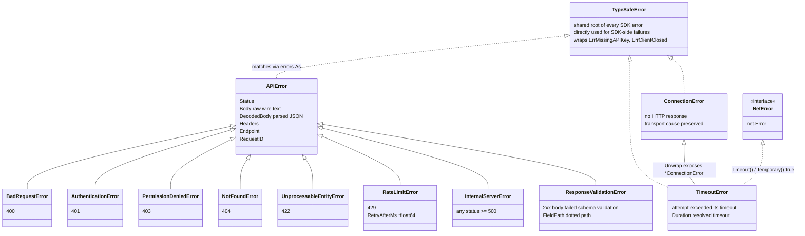
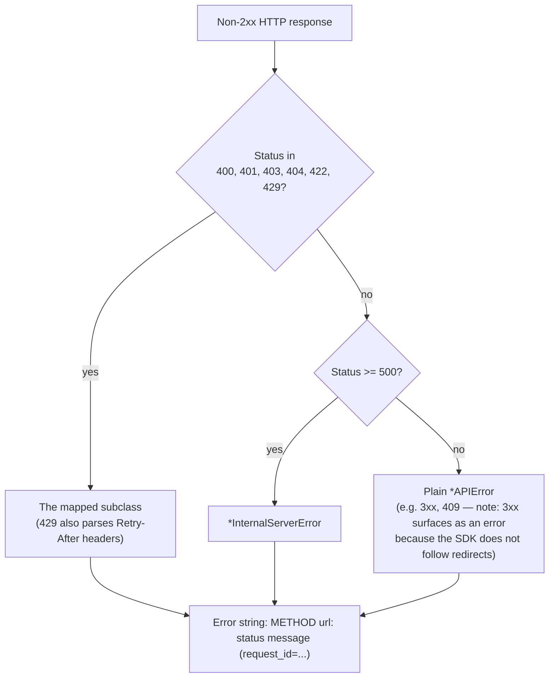
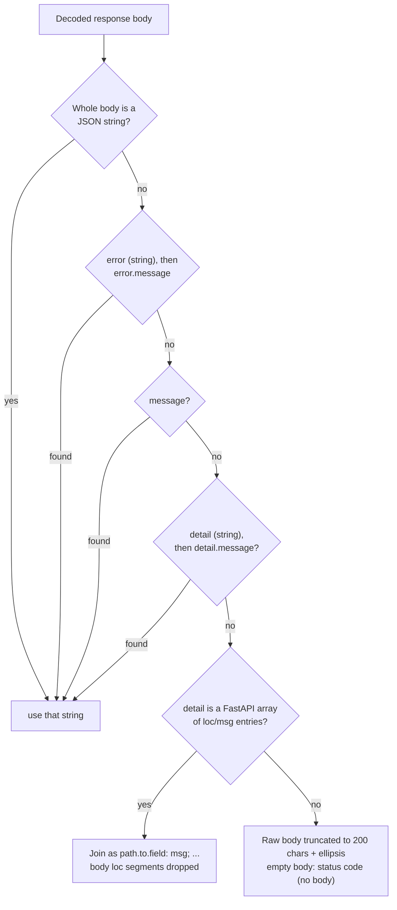

# Error handling

Every failure an SDK call can produce is a Go error matched with
`errors.As` (or `errors.Is` for sentinels). Owner: `errors.go`; taxonomy and
message extraction locked by `errors_test.go`, contract in
[contracts.md §2](../plans/2026-09-19-typesafe-sdk-go/contracts.md).

## Taxonomy



Arrows mean "matches with `errors.As`". Go has no inheritance: each subclass
**embeds** `*APIError` and exposes `Unwrap() error` to it, which is why a
subclass matches both its specific type and `*APIError`. `*TimeoutError`
additionally unwraps to a `*ConnectionError` (mirroring the Python class
hierarchy) and satisfies `net.Error`.

## Matching recipes

```go
// A specific class — plus everything on it:
var rl *typesafe.RateLimitError
if errors.As(err, &rl) && rl.RetryAfterMs != nil {
    fmt.Println("retry after ms:", *rl.RetryAfterMs)
}

// Any non-2xx response:
var apiErr *typesafe.APIError
if errors.As(err, &apiErr) { /* apiErr.Status, Body, Headers, Endpoint, RequestID */ }

// A 2xx body that violated the response schema:
var rv *typesafe.ResponseValidationError
if errors.As(err, &rv) { log.Println(rv.FieldPath) }

// Catch-all — every SDK error matches the shared root:
var root *typesafe.TypeSafeError
if errors.As(err, &root) { log.Printf("typesafe call failed: %v", root) }

// SDK-side failures carry sentinels for errors.Is:
if errors.Is(err, typesafe.ErrMissingAPIKey) { ... }
if errors.Is(err, typesafe.ErrClientClosed) { ... }
```

**What is not an SDK error:** caller cancellation and deadline expiry return
`context.Canceled` / `context.DeadlineExceeded` directly, unwrapped and never
retried. They do not match `*TypeSafeError` — treat them as your own
cancellation, not an API failure.

## How a status becomes an error



Example `Error()` output — parts are omitted when absent:

```
POST https://api.typesafe.ai/v1/systemone: 429 Too many requests (request_id=req_123)
```

## How the message is extracted

The human-readable message inside `*APIError` is pulled from the response
body with a fixed precedence (`extractMessage` + `deriveAPIMessage`):



Details that matter:

- FastAPI `loc` segments are joined with **dots** (`questions.0`) — distinct
  from `ResponseValidationError.FieldPath`, which uses `[i]`.
- Invalid-JSON bodies decode leniently as UTF-8 text (invalid runs collapse
  to one replacement character) and fall through to truncation.
- The API key never appears in any error message or log output.

## Connection and timeout failures

Failures without an HTTP response are classified in the attempt layer
(`transport.go`): a per-attempt deadline expiry or a `net.Error` timeout
becomes `*TimeoutError`; any other transport failure becomes
`*ConnectionError` with the cause preserved via `Unwrap`. A caller context
that ends mid-flight propagates `ctx.Err()` unwrapped instead. Which of these
get retried is [Retries and timeouts](retries.md)'s subject.
