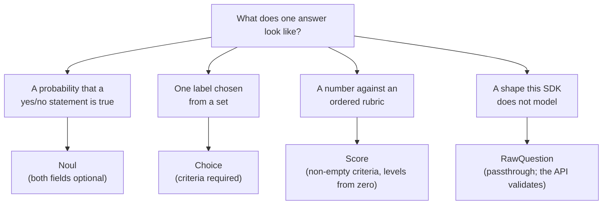

# Getting started

## Prerequisites

- Go 1.27 or newer.
- A TypeSafe API key. The SDK reads it from the `TYPESAFE_API_KEY` environment
  variable unless you pass it explicitly — see
  [Configuration](configuration.md) for the full precedence rules.

## Install

```sh
go get github.com/captain-corgi/typesafe-sdk-go
```

The import path ends in `typesafe-sdk-go`, but the package name is
`typesafe` (the same convention as `go-openai`):

```go
import "github.com/captain-corgi/typesafe-sdk-go" // package typesafe
```

## Your first call

One request carries a state plus any number of named questions; the question
kind you ask determines the statically-known answer type you get back.

```go
client, err := typesafe.NewClient() // reads TYPESAFE_API_KEY
if err != nil {
    return err
}
defer client.Close()

resp, err := client.SystemOne(ctx, &typesafe.SystemOneParams{
    State: map[string]any{"document": "I was charged twice. Please fix this ASAP."},
    Questions: typesafe.Questions{
        "category": typesafe.Choice{
            Instructions: "What is this ticket about?",
            Criteria:     typesafe.ChoiceCriteria{"billing": nil, "technical": nil, "other": nil},
        },
        "urgent": typesafe.Noul{Instructions: "Is this urgent?"},
        "tone": typesafe.Score{
            Instructions: "How polite is the tone?",
            Criteria:     typesafe.ScoreCriteria{"rude", "neutral", "polite"},
        },
    },
})
if err != nil {
    return err
}

fmt.Println(resp.Choices()["category"].Choice) // "billing"
fmt.Println(resp.Nouls()["urgent"].Noul)       // 0.92
fmt.Println(resp.Scores()["tone"].Score)       // 1.4 — expected value, may be fractional
```

| Question kind | Ask about | Typed answer |
|---|---|---|
| `Noul` | yes/no | `NoulAnswer{Noul float64}` — probability of true, 0..1 |
| `Choice` | classification | `ChoiceAnswer{Choice string, Confidence float64, Probabilities map[string]float64}` |
| `Score` | rubric scoring | `ScoreAnswer{Score, Confidence float64, Legend map[int]any, Probabilities map[int]float64}` |

Questions are values: build them inline. Validation happens **before any
network I/O** — a bad question map fails fast with a `*typesafe.TypeSafeError`
and sends zero HTTP attempts (see [Questions](questions.md)).

Listing models is the other call:

```go
models, err := client.Models.List(ctx, nil) // *typesafe.ListModelsResponse
```

## Which question kind do I need?



## Error handling and retries in one minute

Match errors with `errors.As`; the taxonomy and recipes are in
[Error handling](errors.md). Every request runs under a
[RetryPolicy](retries.md) that already retries transient failures with
backoff — you usually configure nothing.

## Runnable examples

Cookbook programs live in [`examples/`](../examples/README.md): quickstart,
ticket triage, intent routing, lead scoring, guardrails, re-ranking, and
retries/error handling. Each is a `package main` program, standard library
only, and runs against the live API:

```sh
TYPESAFE_API_KEY=ts_live_... go run ./examples/quickstart
```

## Next steps

- [Configuration](configuration.md) — options, environment variables, timeouts.
- [Responses](responses.md) — typed answers, usage, raw access.
- [Wire protocol](wire-protocol.md) — what goes over HTTP.
