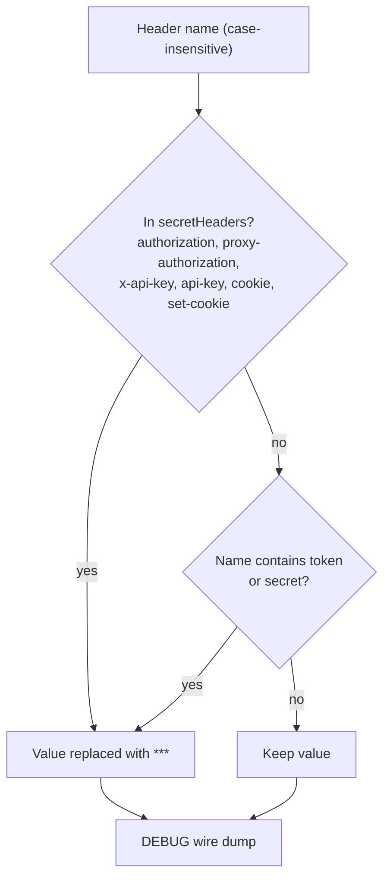

# Observability

The SDK logs through `log/slog` and is **silent by default** — a library must
not log unless asked. Owner: `logging.go`; locked by `logging_test.go`,
contract in [contracts.md §5](../plans/2026-09-19-typesafe-sdk-go/contracts.md).

## Turning logging on

Two ways, in increasing order of control:

1. `TYPESAFE_LOG_LEVEL` — one of `debug | info | warn | warning | error | off`
   (applied at init; `warning` is an alias of `warn`).
2. `typesafe.SetLogger(yourLogger)` — full control of destination, format,
   and level. Your logger is attributed `typesafe_sdk`, the same attribution
   as the Python SDK's logger.

The API key never appears in any log output or error message.

## What gets logged

| Event | Level | When |
|---|---|---|
| `response` | INFO | after every HTTP exchange: method, url, status, elapsed ms, request id |
| `retry` | INFO | before each retry attempt: method, url, attempt number |
| `error` | INFO | transport-level failure, with the classified error type |
| `wire` | DEBUG | full request/response dumps — headers redacted, bodies **not** |

## Redaction

Redaction happens at a single choke point — the DEBUG wire dumps:

Note the boundary: secret **headers** are redacted; request and response
**bodies** are not — they are the payload you asked to see at DEBUG level, so
keep DEBUG logs out of untrusted hands.

## Failure triage, quickly

- Nothing logged at all → logging is silent by default; set
  `TYPESAFE_LOG_LEVEL=debug` or call `SetLogger`.
- No `response` event and a `*ConnectionError` / `*TimeoutError` surfaced →
  the failure happened before any HTTP response existed; the transport cause
  is preserved via `Unwrap` ([Error handling](errors.md)).
- A `response` event with a 4xx/5xx status → the typed error carries the
  status, body, headers, and request id; correlate with the server using the
  request id ([Error handling](errors.md), [Retries](retries.md)).
- Repeated `retry` events with the same request id pattern → the server keeps
  asking for delays or returning 5xx; check `Retry-After` values and the
  policy budget ([Retries](retries.md)).
