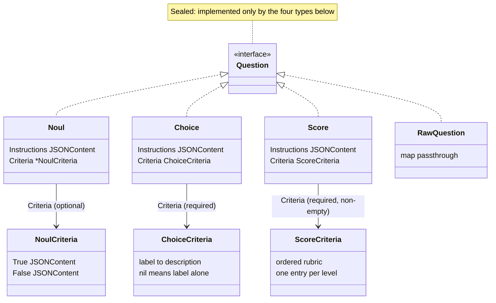
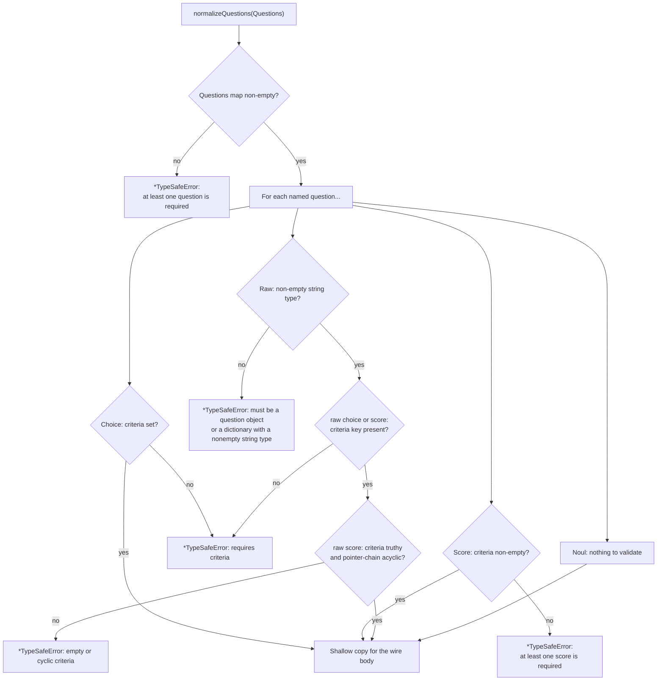

# Questions

Questions are values you build inline and pass by name. The concrete Go type
of the question fixes the Go type of the answer — that is the "type safety" of
the SDK. Owner: `questions.go`; behavior locked by `questions_test.go` and the
wire contract in [contracts.md §1](../plans/2026-09-19-typesafe-sdk-go/contracts.md).

## The four question types



- `Noul` — yes/no; answered by a probability of true, 0..1. Everything
  optional.
- `Choice` — classification into labels; `Criteria` maps each label to an
  optional description (`nil` = label alone).
- `Score` — rubric scoring; `Criteria` is an ordered, non-empty list, one
  entry per score level starting at zero; the returned score is an expected
  value and may be fractional.
- `RawQuestion` — a `map[string]any` sent **untouched** (unknown fields
  included) for question shapes this SDK does not model; the API is the
  schema validator.

```go
// Yes/no, with outcome descriptions.
typesafe.Noul{
    Instructions: "Is this message spam?",
    Criteria: &typesafe.NoulCriteria{
        True:  "Unsolicited advertising",
        False: "A legitimate conversation",
    },
}

// Anything the typed structs cannot express goes on the wire verbatim.
typesafe.RawQuestion{
    "type": "noul", "instructions": "Spam?", "weight": 3,
}
```

## Validation happens before any network I/O

`normalizeQuestions` runs inside `SystemOne` before the body is encoded — a
failing question costs **zero** HTTP attempts and returns a
`*typesafe.TypeSafeError` (Go adaptation: one validation pass for typed and
raw questions, where Python validates at construction — plan §6.3).



Notes on raw score criteria: ordinary pointer/interface chains are followed
with cycle detection; nil pointers count as null; values with custom
`json.Marshaler` / `encoding.TextMarshaler` are passed through for encoding —
their underlying Go zero values are never inspected or invoked during
validation, so a stateful marshaler is safe.

## Wire form rules

The JSON encoding (`questions.go` custom `MarshalJSON`, machinery in
`json.go`) follows three rules:

1. `"type"` is always emitted **first** in every question object.
2. Optional fields left at their zero value (`Instructions`, `Criteria` on a
   `Noul`) are **omitted** from the wire.
3. Explicit `null`s **nested inside** values are preserved — only nil
   optionals are dropped.

```jsonc
// noul — both optionals omitted when unset
{"type": "noul", "instructions": "...?", "criteria": {"true": "...", "false": "..."}}
// choice — criteria required; nil description = label alone
{"type": "choice", "instructions": "...?", "criteria": {"angry": "An upset message", "calm": null}}
// score — criteria required, ordered, non-empty
{"type": "score", "instructions": "...?", "criteria": ["can wait", "this week", "today"]}
```

One deliberate gap: a typed `NoulCriteria` cannot express an explicit JSON
`null` **outcome** (a nil field omits the key, where Python emits
`"true": null`). Use a `RawQuestion` for that wire form
([README deviation 3](../README.md#deviations-from-the-python-sdk)).

## Where answers come back

Answers are keyed by the names you chose and grouped by kind — see
[Responses](responses.md).
