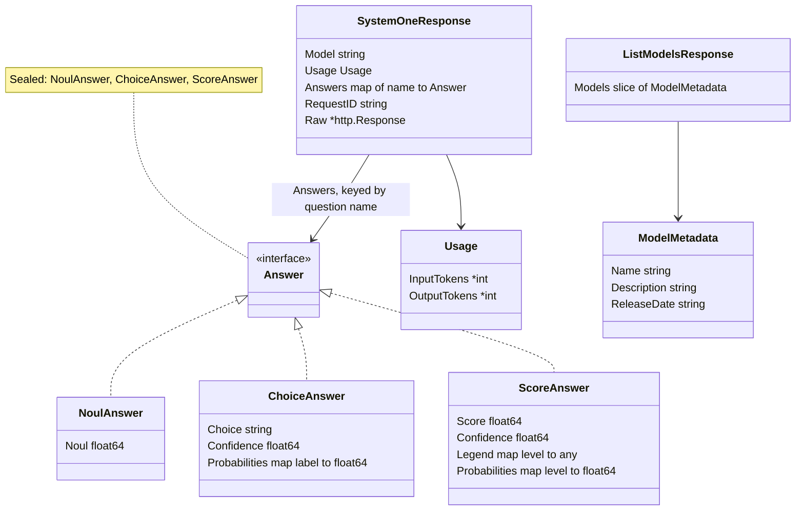
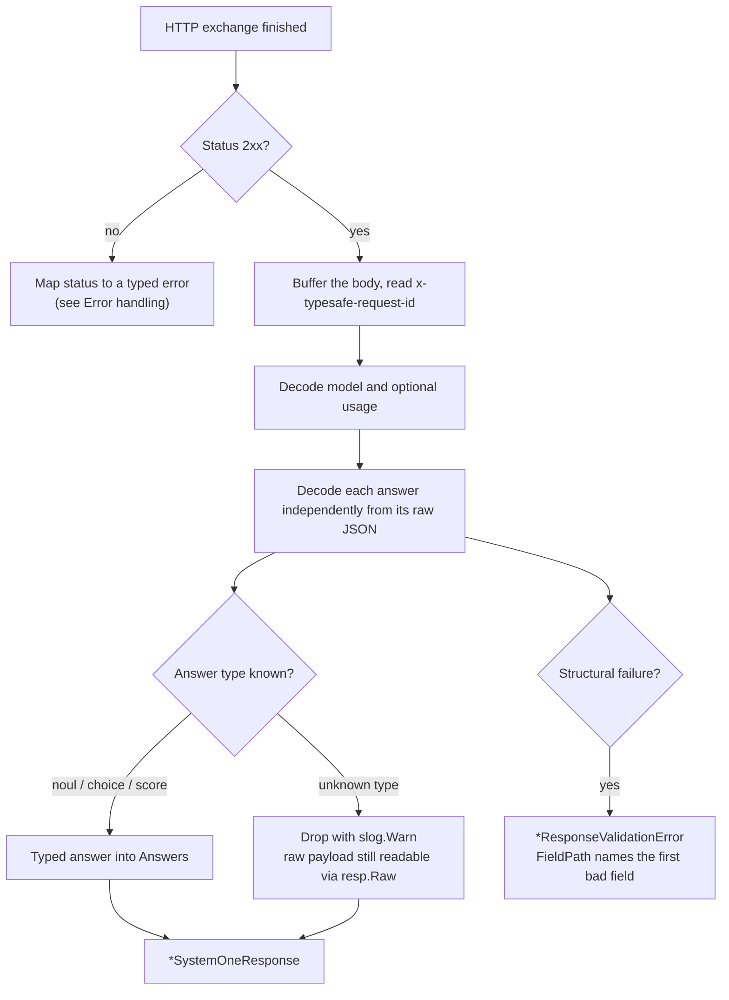

# Responses

Owner: `responses.go`; the decode contract is specified in
[contracts.md §3](../plans/2026-09-19-typesafe-sdk-go/contracts.md) and locked
by `responses_test.go`.

## Shape of a SystemOne response



Answers are grouped by kind so the Go types line up with the questions you
asked:

```go
resp.Model                        // "jev-latest"
resp.Usage.InputTokens            // *int (nil when the API did not report it)
resp.Answers["category"]          // typesafe.Answer interface
resp.Nouls()["urgent"].Noul       // float64
resp.Choices()["category"].Choice // string
resp.Scores()["tone"].Score       // float64 (expected value; may be fractional)
resp.Scores()["tone"].Legend      // map[int]any — level → rubric entry
resp.RequestID                    // "" when the x-typesafe-request-id header is absent
resp.Raw                          // *http.Response with a buffered, readable body
```

The `Nouls()` / `Choices()` / `Scores()` views are type-filtered projections
of `Answers`, memoized after first use. Score `legend` and `probabilities`
arrive with string keys on the wire and are coerced to `map[int]...`.

## Decode pipeline



Behavioral points with parity weight:

- **Unknown answer kinds are forward compatibility, not errors.** A 2xx body
  containing an answer type this SDK version does not model is dropped from
  `Answers` with a warning log, and remains fully readable through `resp.Raw`.
- **Strict-enough decoding.** Unknown fields elsewhere are ignored; usage
  counts are optional. Bodies with `NaN`/`Infinity` literals, out-of-range
  numbers like `1e400`, or usage counts beyond `int64` fail validation
  ([README deviation 5](../README.md#deviations-from-the-python-sdk)).
- **`FieldPath` is dotted**, with list indices as `[i]`:
  `answers.tone.confidence`, `models[1].name`, `answers.s.legend.x`. (Do not
  confuse this with FastAPI error `loc` rendering, which joins with dots —
  see [Error handling](errors.md#how-the-message-is-extracted).)
- Every response carries `RequestID` (from the `x-typesafe-request-id`
  response header) and `Raw` with a buffered body, so a failed typed decode
  never costs you the payload.

## Parsing responses captured outside the client

If a response comes from your own transport or a replayed recording, the same
taxonomy is available as free functions — the counterpart of the Python SDK's
`Response.from_http_response`:

```go
typesafe.ParseSystemOneResponse(resp)     // (*SystemOneResponse, error)
typesafe.ParseListModelsResponse(resp)    // (*ListModelsResponse, error)
```

They buffer the body, map non-2xx statuses to the typed error classes, and
parse 2xx bodies exactly like the client path.

## Errors from any of this

Every decode failure is an SDK error — start at
[Error handling](errors.md).
