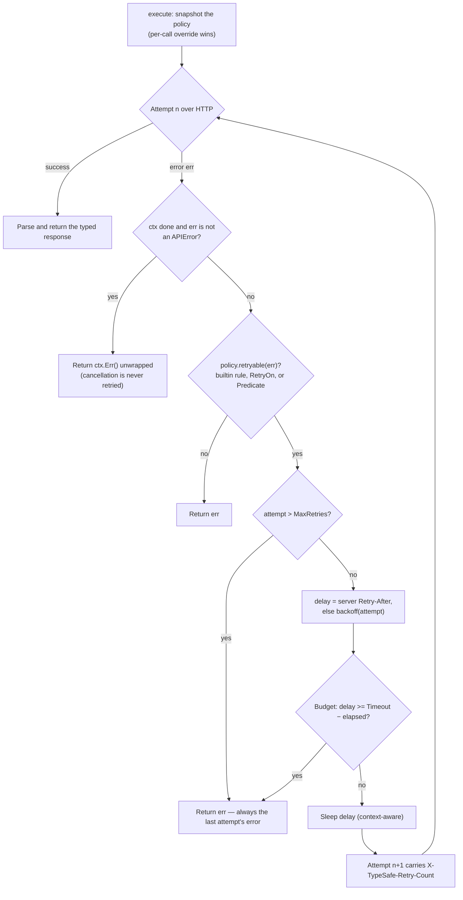
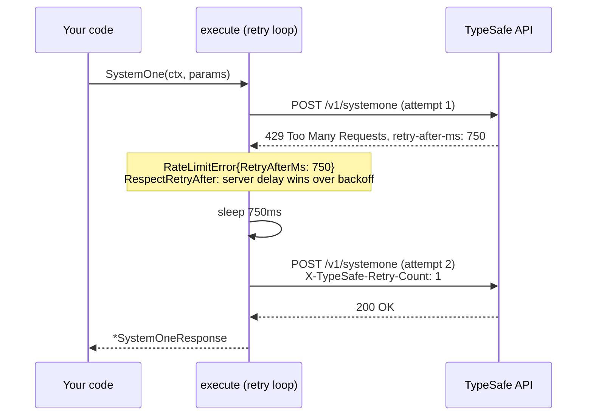
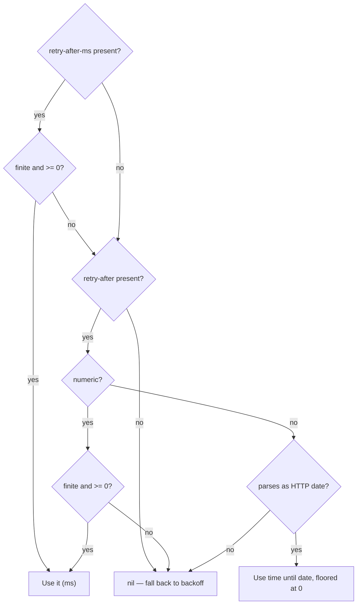

# Retries and timeouts

Every request runs under a `RetryPolicy`. Owner: `retry.go` (policy, backoff,
budget) and `transport.go` (the loop); contract in
[contracts.md §4](../plans/2026-09-19-typesafe-sdk-go/contracts.md), locked by
`retry_test.go` with injected sleep/rand for determinism.

## The default policy

`typesafe.DefaultRetryPolicy()`: two retries on statuses
{408, 429, 500–599}, connection errors, and timeouts; 0.5s→5s exponential
backoff with 25% jitter; server `Retry-After` honored; a 30s total budget per
SDK call. The `RetryPolicy` field reference lives on the struct itself and in
[README §Retries](../README.md#retries); `Validate()` rejects negative
counts/backoffs, jitter outside [0, 1], and a negative budget.

## The loop



Semantics worth knowing:

- **Caller cancellation first.** A canceled context returns before the retry
  condition runs, so your `Predicate` never observes caller-side cancellation
  (a deliberate difference from Python's tenacity, which calls it with
  `CancelledError`).
- **The retry condition runs on every failed attempt**, including the final
  one that will not be retried — counting or logging predicates observe every
  failure, like the Python policy.
- **Stop-before-delay budget.** The budget (`Timeout`, default 30s, 0 =
  unlimited) does not interrupt an in-flight attempt; the loop simply refuses
  to *begin* a retry whose preceding delay would reach the budget, surfacing
  the last error. The budget resets per SDK call.
- The policy is **snapshotted per call** (deep-copied), so concurrent calls
  with different overrides cannot interfere; a per-call `Retry` replaces the
  client policy for that call only.

## A retry, end to end



## Delay math

When there is no server-requested delay (or `RespectRetryAfter` is false),
the delay is exponential backoff with subtractive jitter:

```
exponential = min(BackoffInitial · 2^(attempt−1), BackoffMax)
delay       = round(exponential · (1 − rand() · BackoffJitter), 3 decimals)
```

never exceeding the un-jittered cap. With defaults the un-jittered sequence
is:

| Attempt failed | Delay before next attempt |
|---|---|
| 1 | 0.5s |
| 2 | 1.0s |
| 3 | 2.0s |
| 4 | 4.0s |
| 5 | 5.0s (cap from here) |

At maximum jitter (`rand() = 1.0`) each delay is scaled to 75% of these
values (floor 0.375s on the first). `BackoffInitial: 0` disables backoff
entirely; `MaxRetries: 0` disables retries (one attempt total).

Server-requested delays parse from `retry-after-ms` first, then
`retry-after` (seconds ×1000, or an HTTP date → time remaining, floored at 0);
a negative or non-finite value is not usable.



Empty header values count as zero. An exhausted 429 still surfaces
`RateLimitError.RetryAfterMs` so you can schedule your own retry.

## Customizing what gets retried

`RetryOn` entries come in two forms, and the difference is deliberate:

- **Type selectors** — an SDK error instance (`&NotFoundError{}`) or a typed
  nil (`(*MyError)(nil)`): matched via `errors.As`, so wrapped,
  `errors.Join`-ed, and custom-`As` errors all match.
- **Sentinels** — any other value: matched strictly by identity via
  `errors.Is`. Two distinct errors of the same concrete type never match each
  other; give a sentinel a custom `Is` method or use `Predicate` for
  class-based matching of custom errors.

`Predicate` covers anything else and runs once per failed attempt. The full
worked example lives in [`examples/retries-errors`](../examples/retries-errors).

## Timeouts vs the budget

Two independent clocks: the **per-attempt timeout** (resolution rules in
[Configuration](configuration.md#timeout-resolution)) bounds one HTTP
exchange and expires into `*TimeoutError`; the **policy budget** bounds the
whole call including all attempts and delays. Exceeding the budget surfaces
the last attempt's error, never a budget-specific error.
