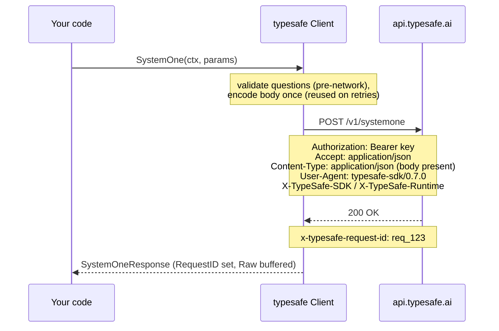
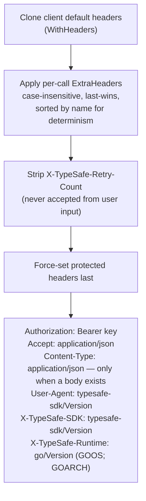
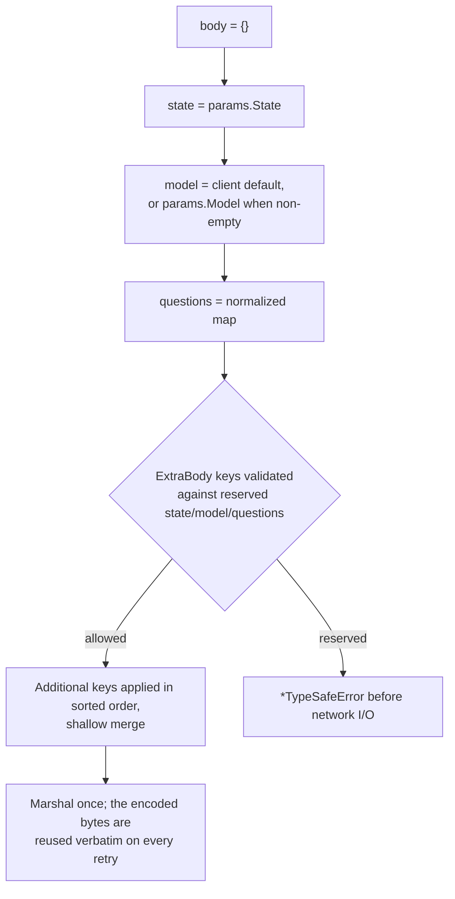

# Wire protocol

What the SDK actually sends and reads on HTTP. Owners: `transport.go`
(request prep, header merge), `json.go` (encoding), `constants.go` (paths,
header names, defaults); contract in
[contracts.md §1](../plans/2026-09-19-typesafe-sdk-go/contracts.md), locked by
the exact round-trip and header-protection matrices in `client_test.go` and
`contracts_test.go`.

## Endpoints

| | |
|---|---|
| `POST /v1/systemone` | body `{"state", "model", "questions": {name: question}}` plus any `ExtraBody` fields |
| `GET /v1/models` | no body |

## A call on the wire

## Header merge order

Consequences: user headers can never override the protected set (checked
case-insensitively by the header-protection test matrix), and a first attempt
never carries `X-TypeSafe-Retry-Count` — retries set it to the retry number
(attempt 2 → `1`).

Headers the SDK **consumes** from responses: `x-typesafe-request-id` →
`resp.RequestID`; `retry-after` and `retry-after-ms` → retry delay
([Retries](retries.md)).

## Request body composition

`ExtraBody` adds top-level fields in sorted order. `state`, `model`, and
`questions` are reserved; attempting to override one fails before encoding or
network I/O. Other object values are replaced, not deep-merged.

## Encoding rules

The custom marshalers in `questions.go` and `json.go` enforce the wire rules
from [Questions](questions.md#wire-form-rules):

- `"type"` first in every question object; nil optionals omitted; explicit
  `null`s nested inside values preserved; raw questions pass through
  untouched.
- Objects are emitted with **sorted keys** (Python preserves insertion
  order), and Go's encoder escapes U+2028/U+2029 — parsed values are
  identical; see [README deviation 10](../README.md#deviations-from-the-python-sdk).
- Unencodable bodies fail before any network I/O with a
  `*TypeSafeError`.

## Response headers and redirects

The SDK's default HTTP client does not follow redirects: a 3xx response
surfaces as a plain `*APIError`, matching the other TypeSafe SDKs. Supply
your own client via `WithHTTPClient` to change that
([Configuration](configuration.md#timeout-resolution)).

Defaults (base URL, model, timeout, environment variables) are owned by
[Configuration](configuration.md) and `constants.go`.

Responses are buffered with a 16 MiB default limit (configurable through
`WithMaxResponseBodySize`). Oversized responses return
`*ResponseTooLargeError` and are not retried.
